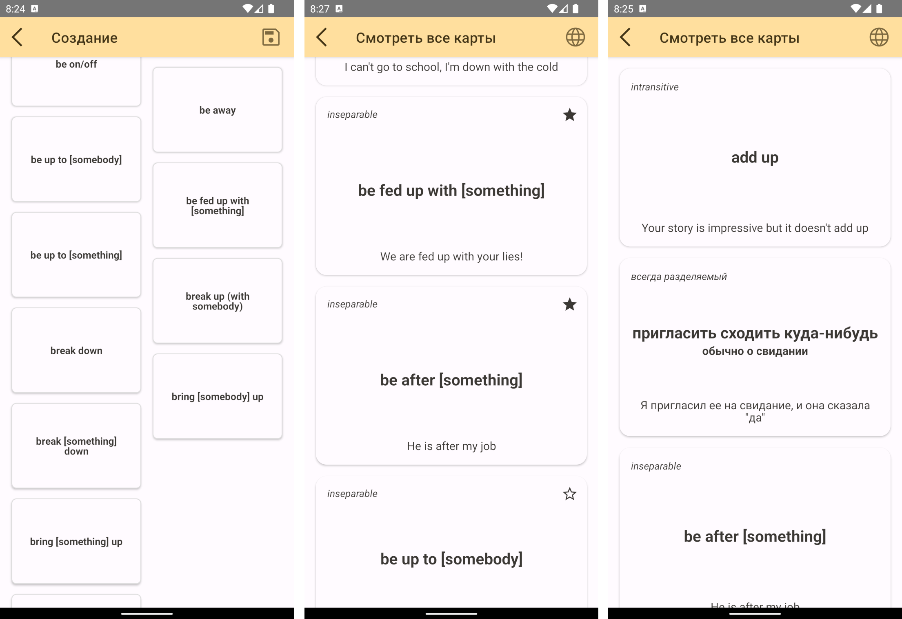

# English phrasal verbs for Russian speakers

This application has been written by me for learning KMM technology. It contains a set of cards with English phrasal verbs translated to Russian. I hope it can help Russian native speakers (like your humble servant) to drill this tricky topic.

